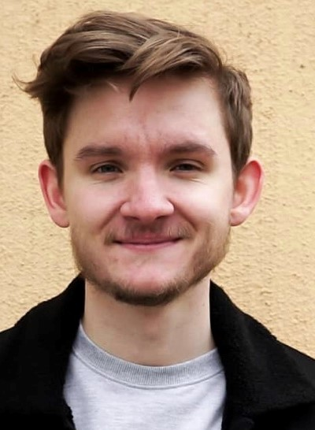

# A Deep Convolutional Network Transfer Based on the LJ Speech Dataset and Kyubyoung's Text to Speech Model

The goal of this was to take a speech data set with thousands of samples such as the LJ speech dataset and then once trained significantly on that model begin training with a dataset that consisted of significantly less samples.

[LJ Speech Dataset](https://www.dropbox.com/s/1oyipstjxh2n5wo/LJ_logdir.tar?dl=0).

[Kyubyong's Text to Speech](https://github.com/Kyubyong/dc_tts).

## Process

Becasue this is based on Kyubyongs model if youre looking for in depth information about how to get a text to speech model like this working you should check out his link as I will only be covering how I transfered the model over to the voice of my choice and then implemented it on a discord server for ease of acess.

One thing you notice imediately is that without the huge premade dataset it takes a LONG time to create and transcribe your own. the LJ dataset has over 13,000 samples of pre transcribed audio and its a breeze to work with. Now when it comes to making the voice of your choice you either have to be lucky enough to find a premade dataset or creat your own. 

Because I wanted to create a speech model based off of Teo, a popular streamer and youtuber, I had to transcribe and sample my own audio.[Teo's Twitch](https://www.twitch.tv/teosgame),[Teo's Youtube](https://www.youtube.com/channel/UCDa8HbNrmkFhKKOeiB7JaRw).

Because He's a personality there are allot of clips of him talking but I had to find clips void of any sort of background noise like music or gameplay. While transcribing audio you also find out how much people say things like "uh" or "uhm" or even repeat themselves without you noticing. One of the challanges of this was actually making sure i was transcribing the correctly especially when you have a phrase like [this](https://soundcloud.com/leighton-waters/what). 

I ended up transcribing around 25 min of video and it took allot longer than I had expected as well as being a dry tedious task that I couldnt listen to shows or music while doing to make it any more enjoyable.

Once Transcribing was over and I could finally run the samples through training I ended ep with an attention graph like this.
